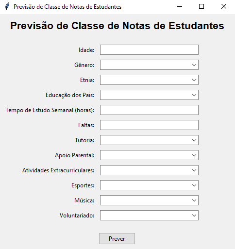

# 🧠 Predição de Classe de Notas de Estudantes - Projeto de Inteligência Artificial 🧠

<p align="left">
    
</p>

Bem-vindo ao repositório do projeto de Predição de Classe de Notas de Estudantes. Este projeto visa criar um modelo de aprendizado de máquina capaz de prever a classificação dos estudantes com base em diversas características demográficas, hábitos de estudo, envolvimento parental, atividades extracurriculares e desempenho acadêmico.

<p align="center">
  
</p>

<hr>

## 📝 Sobre o Projeto

O projeto de Predição de Classe de Notas de Estudantes tem como objetivo desenvolver um modelo de aprendizado de máquina capaz de prever a classe de nota de um estudante. O modelo treinado será capaz de analisar esses dados e prever se um estudante está mais propenso a ter uma determinada classe de nota com base em diversas características.

### 📊 Informações dos Dados

| Coluna               | Descrição                                                                 |
|----------------------|---------------------------------------------------------------------------|
| **`StudentID`**      | Identificação única de cada estudante.                                   |
| **`Age`**            | Idade dos estudantes, variando de 15 a 18 anos.                         |
| **`Gender`**         | Gênero dos estudantes, onde 0 representa Masculino e 1 representa Feminino. |
| **`Ethnicity`**      | Etnia dos estudantes, codificada da seguinte forma:<br>**0:** Caucasiano<br>**1:** Afro-americano<br>**2:** Asiático<br>**3:** Outro |
| **`ParentalEducation`**  | Nível de educação dos pais, codificado da seguinte forma:<br>**0:** Nenhum<br>**1:** Ensino Médio<br>**2:** Alguma Faculdade<br>3: Bacharelado<br>4: Superior |
| **`StudyTimeWeekly`**    | Tempo semanal de estudo em horas, variando de 0 a 20.                  |
| **`Absences`**           | Número de faltas durante o ano letivo, variando de 0 a 30.             |
| **`Tutoring`**           | Status de tutoria, onde 0 indica Não e 1 indica Sim.                   |
| **`ParentalSupport`**    | Nível de apoio parental, codificado da seguinte forma:<br>**0:** Nenhum<br>**1:** Baixo<br>**2:** Moderado<br>**3:** Alto<br>**4:** Muito Alto |
| **`Extracurricular`**    | Participação em atividades extracurriculares, onde 0 indica Não e 1 indica Sim. |
| **`Sports`**             | Participação em esportes, onde 0 indica Não e 1 indica Sim.            |
| **`Music`**              | Participação em atividades musicais, onde 0 indica Não e 1 indica Sim. |
| **`Volunteering`**       | Participação em voluntariado, onde 0 indica Não e 1 indica Sim.        |
| **`GPA`**                | Média de notas em uma escala de 0.0 a 4.0, influenciada por hábitos de estudo, envolvimento parental e atividades extracurriculares. |
| **`GradeClass`**         | Classificação das notas dos estudantes com base no GPA:<br>**0:** 'A' (GPA >= 3.5)<br>**1:** 'B' (3.0 <= GPA < 3.5)<br>**2:** 'C' (2.5 <= GPA < 3.0)<br>**3:** 'D' (2.0 <= GPA < 2.5)<br>**4:** 'F' (GPA < 2.0) |


### 🛠️ Funcionalidades Principais

- **Pré-processamento dos Dados:** Realizar limpeza e o pré-processamento dos dados a fim de remover dados errados, discrepantes, faltosos e entre outros.
- **Preparação dos Dados:** Realizar a preparação das características (features) e o alvo (target) para a modelagem e o treinamento do modelo.
- **Treinamento do Modelo:** Utilizar algoritmos de aprendizado de máquina para treinar um modelo de classificação, como o Random Forest.
- **Avaliação do Modelo:** Avaliar a performance do modelo utilizando métricas como precisão, recall, F1-score e acurácia.
- **Previsão de Novos Dados:** Utilizar o modelo treinado para prever a classe de nota de novos estudantes com base em seus dados.

## ⚙️ Tecnologias Utilizadas

O projeto está sendo desenvolvido utilizando as seguintes tecnologias e ferramentas:

- **Linguagem de Programação [Python](https://www.python.org/):** Linguagem de programação de alto nível amplamente utilizada em ciência de dados e aprendizado de máquina.

- **Bibliotecas de Manipulação e Análise de Dados:** Utilizamos a biblioteca [pandas](https://pandas.pydata.org/) para manipulação e análise de dados. O pandas é uma ferramenta poderosa para trabalhar com dados tabulares, oferecendo estruturas de dados flexíveis e eficientes, como o DataFrame.

- **Bibliotecas de Machine Learning:** Utilizamos as bibliotecas [scikit-learn](https://scikit-learn.org/stable/) para construir e avaliar os modelos de aprendizado de máquina. O scikit-learn é uma biblioteca essencial para análise de dados e modelagem preditiva, incluindo:
  - **[Logistic Regression](https://scikit-learn.org/stable/modules/generated/sklearn.linear_model.LogisticRegression.html):** Modelo de regressão logística para classificação.
  - **[Random Forest Classifier](https://scikit-learn.org/stable/modules/generated/sklearn.ensemble.RandomForestClassifier.html):** Modelo de floresta aleatória para classificação.

- **Bibliotecas de Balanceamento de Dados:** Utilizamos a biblioteca [imbalanced-learn](https://imbalanced-learn.org/) para balancear os dados e tratar problemas de desequilíbrio, incluindo:
  - **[SMOTEENN](https://imbalanced-learn.org/stable/references/generated/imblearn.combine.SMOTEENN.html):** Combina SMOTE e Edited Nearest Neighbours para balanceamento de dados.
  - **[Random Under Sampling](https://imbalanced-learn.org/stable/references/generated/imblearn.under_sampling.RandomUnderSampler.html):** Reduz o número de exemplos da classe majoritária para balancear os dados.
  - **[Edited Nearest Neighbours](https://imbalanced-learn.org/stable/references/generated/imblearn.under_sampling.EditedNearestNeighbours.html):** Corrige exemplos mal classificados pelo modelo.

- **Ferramentas de Visualização de Dados:** Utilizamos bibliotecas como [Matplotlib](https://matplotlib.org/) e [Seaborn](https://seaborn.pydata.org/) para criar visualizações dos dados e resultados dos modelos:
  - **[Matplotlib](https://matplotlib.org/):** Biblioteca de visualização para criar gráficos estáticos, animados e interativos em Python.
  - **[Seaborn](https://seaborn.pydata.org/):** Interface de alto nível baseada no Matplotlib para criar gráficos estatísticos atraentes e informativos.

- **Ferramenta de Persistência de Modelos:** Utilizamos [joblib](https://joblib.readthedocs.io/en/latest/) para persistir e carregar modelos treinados, facilitando a reutilização e implementação de modelos em produção.


## 📂 Estrutura do Repositório

- **`databases/`:** Pasta contendo os conjuntos de dados (databases/datasets) utilizados no projeto.
- **`model/`:** Pasta contendo os modelos treinados.
- **`notebooks/`:** Pasta contendo os notebooks Jupyter com os experimentos e análises realizadas.
- **`README.md`:** Documentação do projeto com informações sobre os objetivos, funcionalidades, tecnologias utilizadas, entre outros.

## 📝 Exemplo de Uso

Para fazer previsões com o modelo treinado, utilize a função `predict_grade_class` que recebe um DataFrame com os dados dos novos estudantes e retorna as previsões de classe de nota.

### Exemplo de Uso do Código

```python
import joblib
import pandas as pd

def predict_grade_class(model, new_data):
    """
    Função para prever a classe de nota de um estudante.
    
    Parâmetros:
    - model: Modelo treinado.
    - new_data: DataFrame contendo as novas entradas para previsão.
    
    Retorna:
    - Predições de classe de nota.
    """
    prediction = model.predict(new_data)
    return prediction

# Carregar modelo
model = joblib.load("models/students_model_random_forest.pkl")

# Dados do novo estudante sem a coluna 'StudentID'
new_student_data = pd.DataFrame({
    'Age': [15],
    'Gender': [0],
    'Ethnicity': [2],
    'ParentalEducation': [3],
    'StudyTimeWeekly': [4.2],
    'Absences': [26],
    'Tutoring': [0],
    'ParentalSupport': [2],
    'Extracurricular': [0],
    'Sports': [0],
    'Music': [0],
    'Volunteering': [0],
    'GPA': [0.11]
})

# Previsão
grade_class_prediction = predict_grade_class(model, new_student_data)
print(f'Predição da classe de nota: {grade_class_prediction[0]}') # Saída: 4.0
